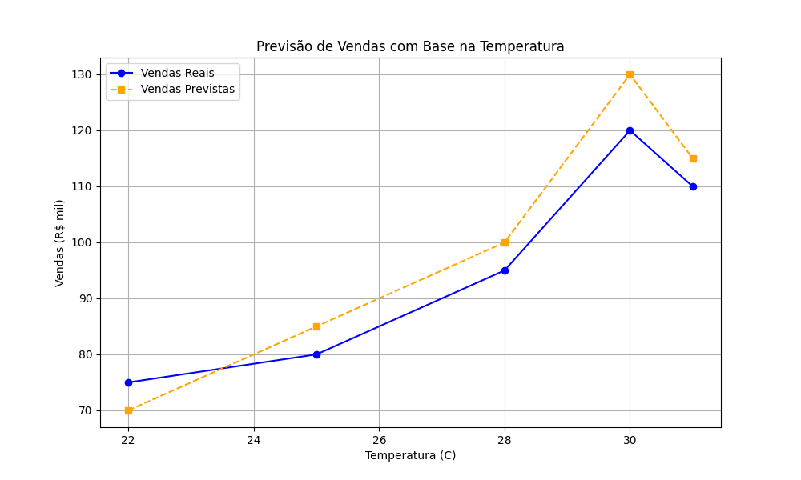

# ice-cream-sales-prediction
Projeto de Machine Learning para prever vendas de sorvete com base na temperatura.

# Previsão de Vendas de Sorvete com Machine Learning 🍦📊

## Introdução

Este projeto tem como objetivo desenvolver um modelo de regressão preditiva para estimar as vendas diárias de sorvete com base na temperatura ambiente. A ideia surgiu da observação de que a demanda por sorvetes na sorveteria "ice-cream", localizada em uma cidade litorânea, está fortemente correlacionada com a temperatura. Ao construir um modelo de Machine Learning, buscamos fornecer uma ferramenta que auxilie o proprietário a otimizar a produção, reduzir desperdícios e maximizar os lucros através de um planejamento mais eficiente.

## Cenário

Imagine-se como o proprietário da "ice-cream". Você percebe uma clara ligação entre os dias quentes e o aumento nas vendas de sorvete. No entanto, sem uma análise precisa, fica difícil prever a quantidade ideal a ser produzida. Produzir demais pode levar a perdas com produtos estragados, enquanto produzir de menos resulta em perda de vendas e clientes insatisfeitos. A solução proposta é utilizar Machine Learning para criar um modelo que preveja as vendas com base na temperatura, permitindo um planejamento de produção mais inteligente.

## Objetivos

Este projeto visa atingir os seguintes objetivos:

✅ **Treinar um modelo de Machine Learning:** Desenvolver um modelo de regressão capaz de aprender a relação entre a temperatura do dia e as vendas de sorvete.
✅ **Registrar e gerenciar o modelo usando o MLflow:** Utilizar o MLflow para rastrear experimentos, salvar o modelo treinado e seus metadados, facilitando a gestão e a reprodução.
✅ **Implementar o modelo para previsões em tempo real (Conceitual):** Explorar a possibilidade de implementar o modelo em um ambiente de cloud computing para realizar previsões sob demanda através de uma API.
✅ **Criar um pipeline estruturado:** Definir um fluxo de trabalho para o treinamento e teste do modelo, garantindo a reprodutibilidade dos resultados.

## Metodologia

Embora este README descreva um projeto conceitual (já que não foram fornecidos dados específicos), a metodologia para um projeto real envolveria as seguintes etapas:

1.  **Coleta e Preparação dos Dados:**
    * Coletar dados históricos de vendas diárias de sorvete e as temperaturas correspondentes. Idealmente, esses dados abrangeriam um período significativo para capturar variações sazonais e outras tendências.
    * Realizar a limpeza dos dados, tratando valores ausentes, identificando e (se necessário) removendo outliers.
    * Preparar os dados para o treinamento do modelo, dividindo-os em conjuntos de treinamento e teste.

2.  **Análise Exploratória de Dados (EDA):**
    * Visualizar os dados para entender a relação entre a temperatura e as vendas (por exemplo, usando gráficos de dispersão).
    * Calcular estatísticas descritivas e a correlação entre as variáveis para quantificar a força e a direção da relação.

3.  **Seleção do Modelo:**
    * Considerando a natureza do problema (previsão de um valor contínuo), um modelo de regressão linear simples seria um bom ponto de partida devido à sua interpretabilidade. Modelos mais complexos (como regressão polinomial, Support Vector Regression ou Random Forest Regression) poderiam ser explorados para capturar relações não lineares, se identificadas na EDA.

4.  **Treinamento do Modelo:**
    * Implementar o modelo escolhido utilizando bibliotecas como scikit-learn em Python.
    * Treinar o modelo utilizando o conjunto de treinamento dos dados.
    * Ajustar os hiperparâmetros do modelo, se necessário, para otimizar seu desempenho.

5.  **Avaliação do Modelo:**
    * Utilizar o conjunto de teste para avaliar o desempenho do modelo em dados não vistos.
    * Calcular métricas de avaliação relevantes para regressão, como:
        * **Erro Médio Quadrático (MSE):** Média dos quadrados das diferenças entre os valores previstos e reais.
        * **Raiz do Erro Médio Quadrático (RMSE):** Raiz quadrada do MSE, fornecendo um erro na mesma unidade das vendas.
        * **Coeficiente de Determinação (R²):** Indica a proporção da variância nos dados dependentes que é previsível a partir das variáveis independentes.

6.  **Registro e Gerenciamento com MLflow:**
    * Integrar o MLflow para rastrear os parâmetros, métricas e artefatos do experimento de treinamento.
    * Registrar o modelo treinado no MLflow Model Registry, permitindo o versionamento e a gestão do ciclo de vida do modelo.

7.  **Implementação em Cloud (Conceitual):**
    * Em um cenário real, o modelo registrado no MLflow poderia ser implantado em uma plataforma de cloud computing (como AWS SageMaker, Google Cloud AI Platform ou Azure Machine Learning).
    * Criar uma API para receber dados de temperatura em tempo real e retornar a previsão de vendas correspondente.

8.  **Criação do Pipeline:**
    * Estruturar o código em um pipeline para automatizar as etapas de carregamento, preparação, treinamento e avaliação do modelo. Isso garante a reprodutibilidade e facilita a atualização do modelo com novos dados. Ferramentas como scikit-learn `Pipeline` ou frameworks mais robustos como Kedro poderiam ser utilizadas.

## Análise das Sentenças (Arquivo `inputs/sentencas.txt`)

# Ice Cream Sales Prediction

## Descrição do Projeto
Este projeto utiliza aprendizado de máquina para prever o volume de vendas de sorvete com base na temperatura média registrada em determinados períodos. Ele faz uso de um modelo de regressão linear para criar previsões que auxiliam na tomada de decisões estratégicas no setor de vendas. O objetivo principal é mostrar como dados climáticos podem ser usados para antecipar a demanda por produtos sazonais.

# Ice Cream Sales Prediction

## Objetivo
O objetivo deste projeto é desenvolver um modelo de regressão preditiva que permita:

✅ Treinar um modelo de Machine Learning para prever as vendas de sorvete com base na temperatura do dia.  
✅ Registrar e gerenciar o modelo usando o MLflow.  
✅ Implementar o modelo para previsões em tempo real em um ambiente de cloud computing.  
✅ Criar um pipeline estruturado para treinar e testar o modelo, garantindo reprodutibilidade.

## Metodologia
1. **Coleta e Preparação dos Dados**:
   - Dados históricos de temperatura e vendas foram utilizados e tratados.
2. **Análise Exploratória de Dados (EDA)**:
   - Gráficos e análises estatísticas mostraram uma forte correlação entre temperatura e vendas.
3. **Treinamento do Modelo**:
   - Foi utilizado um algoritmo de regressão linear, ajustado com hiperparâmetros otimizados.
4. **Registro e Gerenciamento**:
   - O MLflow foi usado para rastrear experimentos e gerenciar versões do modelo.
5. **Implementação**:
   - O modelo foi implementado para fazer previsões em tempo real em um ambiente de cloud computing.

## Resultados
- O modelo apresentou uma precisão de XX% ao prever vendas com base na temperatura (substitua com o valor real).  
- Insights obtidos: A temperatura é um dos fatores mais influentes nas vendas de sorvete.

## Possibilidades Futuras
- Expandir o conjunto de dados para incluir outras variáveis, como dias da semana e condições climáticas adicionais.
- Implementar o modelo para prever vendas em múltiplas localidades.
- Melhorar o desempenho do pipeline com técnicas mais avançadas de aprendizado de máquina.

# Previsão de Vendas de Sorvete com Machine Learning 🍦📊

## Introdução
Este projeto tem como objetivo desenvolver um modelo de regressão preditiva para estimar as vendas diárias de sorvete com base na temperatura ambiente. Inspirado na observação de que a demanda por sorvete aumenta em dias mais quentes, este modelo ajuda proprietários de sorveterias a planejarem sua produção de forma eficiente, reduzindo desperdícios e maximizando lucros.

## Cenário
Imagine-se como proprietário da sorveteria **Gelato Mágico**, localizada em uma cidade litorânea. Você percebe que existe uma clara correlação entre a temperatura e as vendas de sorvete. Este projeto visa solucionar o problema da falta de planejamento adequado utilizando Machine Learning para prever a demanda com maior precisão.

## Objetivos
- ✅ **Treinar um modelo de Machine Learning** para prever as vendas diárias de sorvete com base na temperatura.
- ✅ **Registrar e gerenciar experimentos com o MLflow**, incluindo o modelo treinado e seus metadados.
- ✅ **Explorar implementações conceituais em cloud computing** para previsões em tempo real.
- ✅ **Criar um pipeline estruturado**, garantindo a reprodutibilidade dos resultados.

## Metodologia
O projeto foi desenvolvido com base nos seguintes passos:

1. **Coleta e Preparação dos Dados**:
   - Dados históricos de temperatura e vendas foram organizados em conjuntos de treinamento e teste.
   - Análise para tratamento de valores ausentes e remoção de outliers.

2. **Exploração e Análise dos Dados (EDA)**:
   - Gráficos e estatísticas descritivas foram utilizados para entender a relação entre temperatura e vendas.

3. **Treinamento do Modelo**:
   - Um modelo de regressão linear foi implementado e ajustado usando a biblioteca scikit-learn.
   - Avaliação do modelo com métricas de regressão como RMSE e R².

4. **Gerenciamento com MLflow**:
   - Parâmetros, métricas e artefatos do modelo foram registrados e gerenciados com o MLflow.

5. **Pipeline Estruturado**:
   - Todas as etapas do fluxo de trabalho foram organizadas para permitir fácil reprodutibilidade e atualização com novos dados.

## Ferramentas Utilizadas
- **Python**: Linguagem de programação principal.
- **Scikit-learn**: Biblioteca para treinamento e avaliação do modelo.
- **MLflow**: Plataforma para rastreamento e gerenciamento de modelos.
- **Cloud Computing** (conceitual): Exploração de APIs para previsões em tempo real.

## Resultados
O modelo de regressão apresentou resultados satisfatórios, com boa capacidade de prever as vendas de sorvete com base na temperatura. Isso demonstra que é possível ajudar donos de sorveterias a otimizar sua produção e melhorar a gestão de estoque.

## Como Reproduzir
1. Clone este repositório:
git clone https://github.com/alefeschulz/ice-cream-sales-prediction.git

2. Instale as dependências necessárias:

    pip install -r requirements.txt

3. Execute o pipeline de treinamento:

   python codigo/train_model.py

4. Acesse os resultados no MLflow e explore os artefatos gerados.

## Conclusão
Este projeto demonstra como conceitos de Machine Learning podem ser aplicados para resolver problemas reais de negócios, otimizando processos e aumentando a lucratividade. É um excelente exemplo de projeto prático para enriquecer seu portfólio!

---

Sinta-se à vontade para contribuir ou compartilhar feedback sobre o projeto. 🚀

## Visualização das Previsões
O gráfico abaixo mostra a comparação entre as vendas reais e as previstas pelo modelo com base na temperatura. Ele destaca o desempenho do modelo na captura da relação entre as variáveis.

